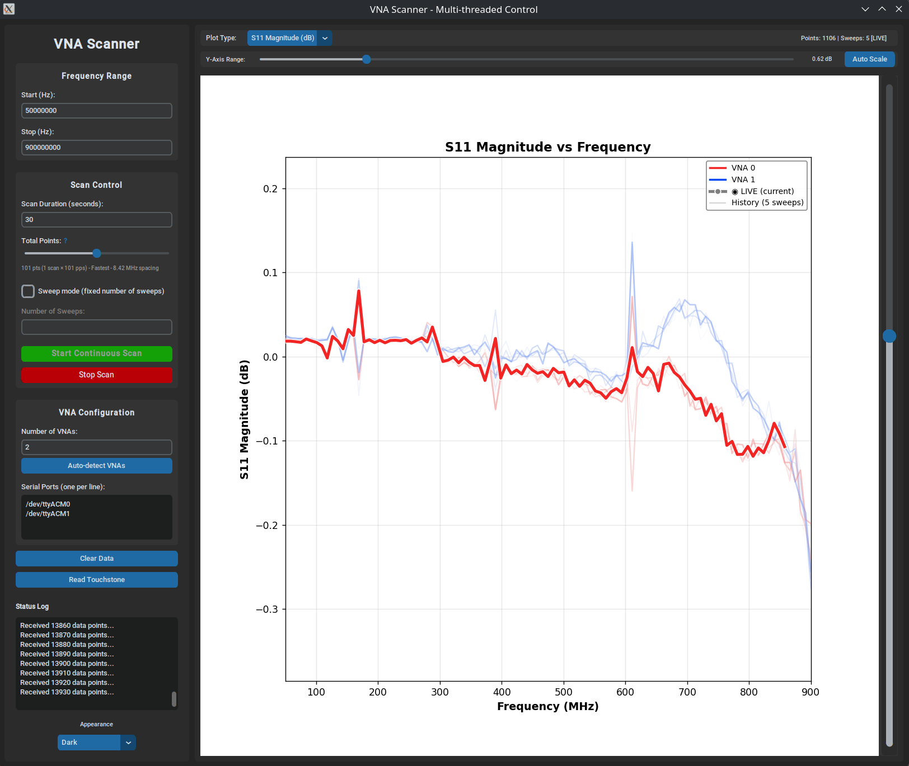

# NanoVNA Scanner GUI

**Team JH05 - University of Glasgow**

A graphical user interface for controlling NanoVNA (Vector Network Analyzer) devices, providing real-time visualisation of S-parameter measurements and intuitive scan configuration.

## Overview

This project provides a modern linux GUI application built with Python and CustomTkinter for interfacing with the VnaScanMultithreaded C scanner. It allows users to configure scan parameters, manage multiple VNA devices, and visualize S-parameter data in real-time.


*VNA Scanner interface showing dual-VNA S11 magnitude measurements with real-time plotting*

### Key Features

- **Modern Dark/Light Theme UI** - Responsive design interface
- **Real-Time Plotting** - Live matplotlib visualization of S11 and S21 magnitude data
- **Multi-VNA Support** - Configure and manage multiple NanoVNA devices simultaneously
- **Auto-Detection** - Automatic discovery of connected VNA devices
- **Flexible Scan Modes** - Continuous scanning, timed scans, or fixed sweep count
- **Adjustable Resolution** - Logarithmic slider for selecting frequency point density

## Project Structure

```
├── src/
│   └── VnaScanGUI/
│       ├── README.md                   # This file
│       ├── requirements.txt            # Python dependencies
│       └── vna_scan_gui.py            # Main GUI application
└── test/
    └── TestVnaScanGUI/
        ├── __init__.py
        ├── requirements.txt            # Test dependencies
        └── test_gui_basics.py          # Unit tests for GUI
```

## Requirements

### Hardware

- NanoVNA-H device (or compatible VNA) - optional for GUI testing

### Software

- **Python 3.9+**
- **Tkinter** (usually included with Python)
- **Linux** (tested)

### Python Dependencies

- customtkinter
- matplotlib
- numpy

## Installation

### 1. Clone Repository

```bash
git clone https://github.com/Jstephenson808/dist_nano_vna_project.git
cd dist_nano_vna_project
```

### 2. Create Virtual Environment

```bash
python3 -m venv .venv
source .venv/bin/activate
```

### 3. Install Dependencies

```bash
pip install -r src/VnaScanGUI/requirements.txt
```

## Usage

### Running the GUI

```bash
cd src/VnaScanGUI
python3 vna_scan_gui.py
```

Or from the project root:

```bash
python3 src/VnaScanGUI/vna_scan_gui.py
```

### GUI Controls

#### Frequency Range

- **Start (Hz)**: Starting frequency for the scan (default: 50 MHz)
- **Stop (Hz)**: Ending frequency for the scan (default: 900 MHz)

#### Scan Control

- **Time Limit**: Duration in seconds for continuous scanning (0 = unlimited)
- **Resolution Multiplier**: Adjusts frequency point density (1-100,000x)
  - Multiplier of 1 = 101 points
  - Multiplier of 10 = 1,010 points
  - Display shows current point count and frequency spacing
- **Sweep Mode**: Toggle between continuous scanning and fixed sweep count

#### VNA Configuration

- **Number of VNAs**: How many devices to use for parallel scanning
- **Auto-detect VNAs**: Automatically find connected devices on `/dev/ttyACM*`
- **Serial Ports**: Manually specify device paths (one per line)

#### Visualization

- **Plot Type**: Select S11 or S21 magnitude display, combined or SWR.
- **Clear Data**: Reset the plot and collected data

#### Appearance

- **Theme Selector**: Switch between System, Dark, and Light modes

## Testing

The GUI has a unit test suite using pytest.

### Running Tests

```bash
# Install test dependencies
pip install -r test/TestVNAGUI/requirements.txt

# Run tests
pytest test/TestVnaScanGUI/ -v
```

## Integration with C Scanner

The GUI is designed to interface with the `VnaCommandParser` C scanner (located in `src/CliApp/`). It constructs command-line arguments and executes the scanner via subprocess, parsing the output for real-time visualization.

## Acknowledgments

- [CustomTkinter](https://github.com/TomSchimansky/CustomTkinter) by Tom Schimansky
- University of Glasgow School of Computing Science
